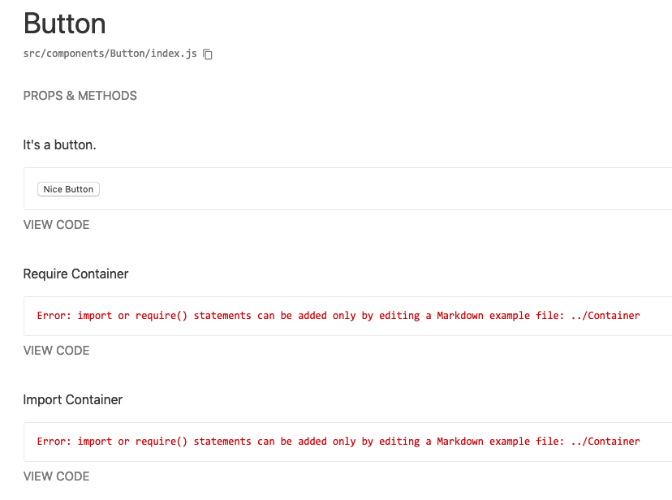

This project demos a bug when attempting to require or import other JS files in Markdown examples in styleguidist.

To reproduce the bug:
```
$ npm install && npm run styleguidist
```

Then open http://localhost:6060/ in your browser. You should see this:


See [the Button Readme.md file](./src/components/Button/Readme.md) for the readme source.

There are included `styleguide.config.js` and `.babelrc` files so you can downgrade to react-styleguidist version 8.0.6 and run it to see that the example that uses require works in that version.

If I `git clone` the current react-styleguidist repo, compile it, and `npm link` it from this repo, the Readme examples work as expected. So there is probably a problem in building the package for distibution on NPM.